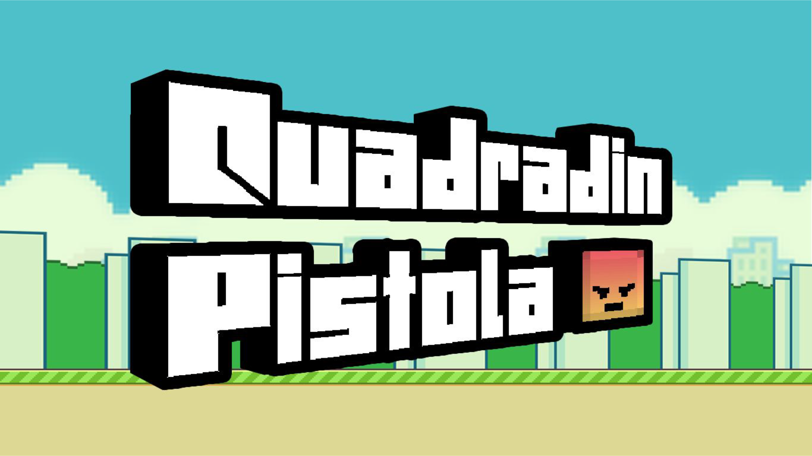
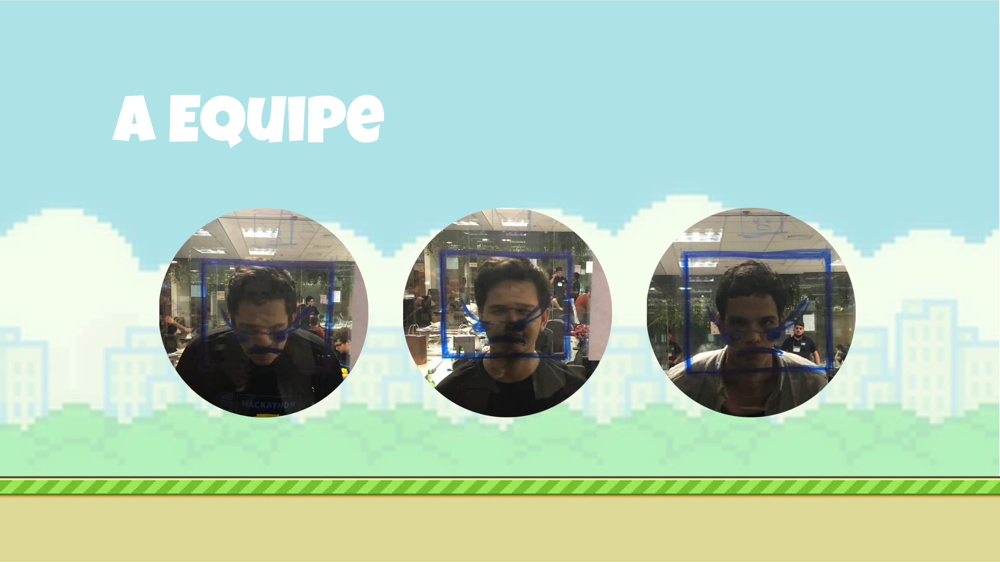
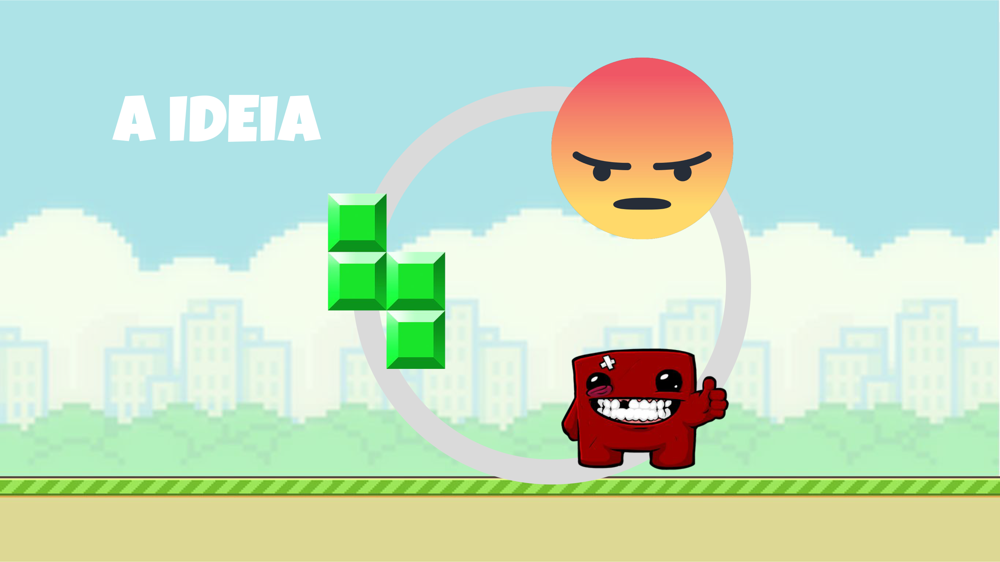
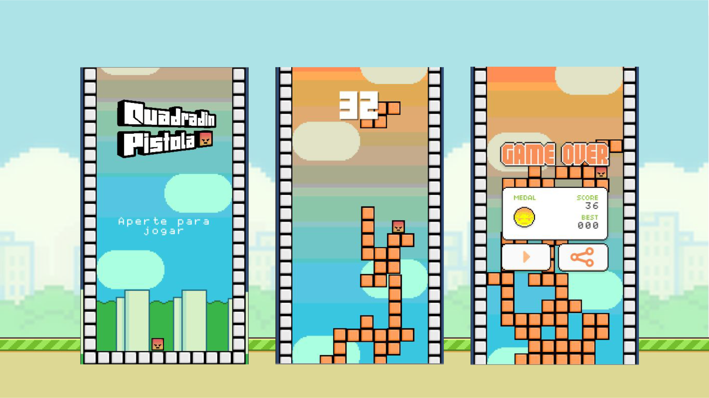

# Quadradin-Pistola
Jogo desenvolvido para a game jam realizada na sede da TFG nos dias 28 a 30 de setembro de 2018
Tempo de desenvolvimento: 40 horas
Posição final: 1º lugar.

Uma versão Beta do jogo para mobile pode ser instalada através do [apk](quadradin.apk)

